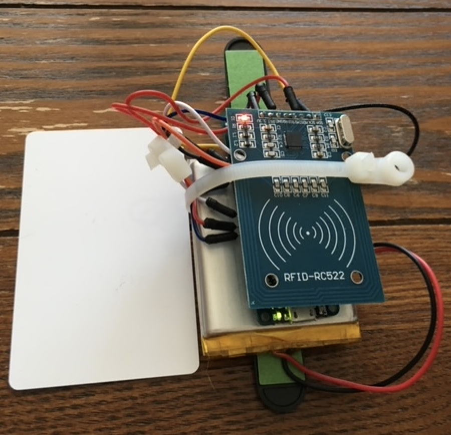
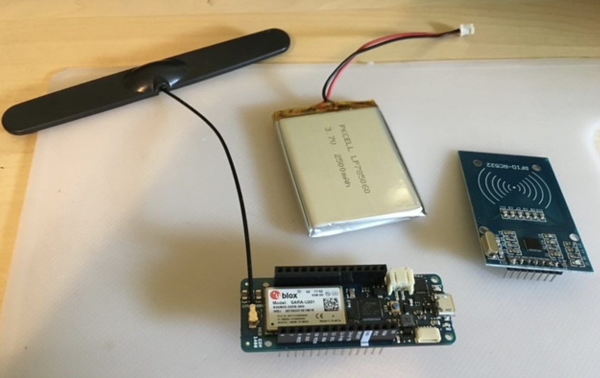
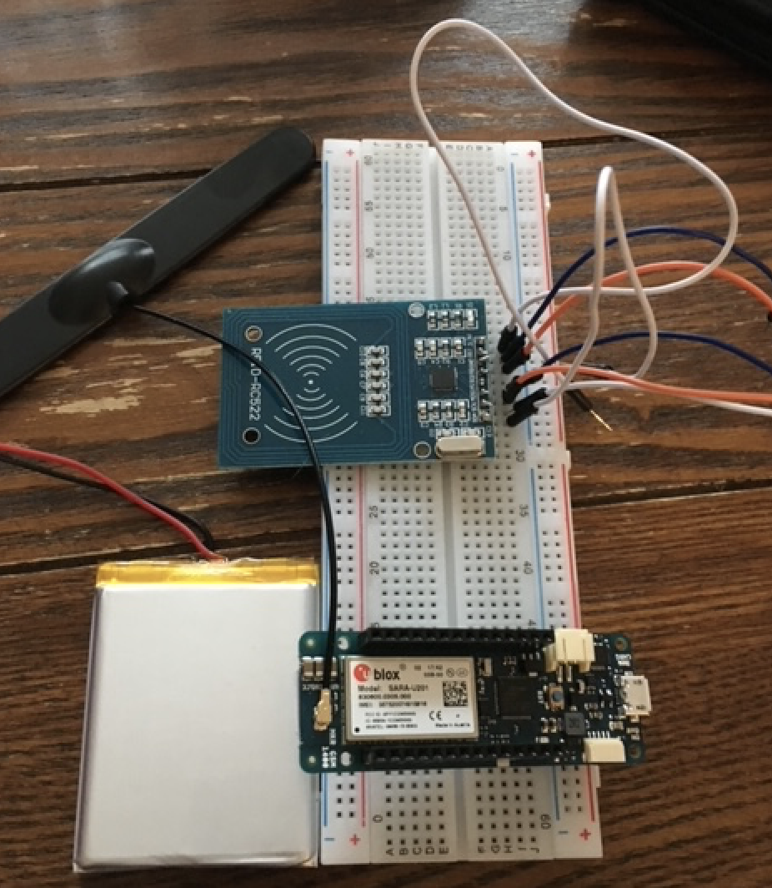
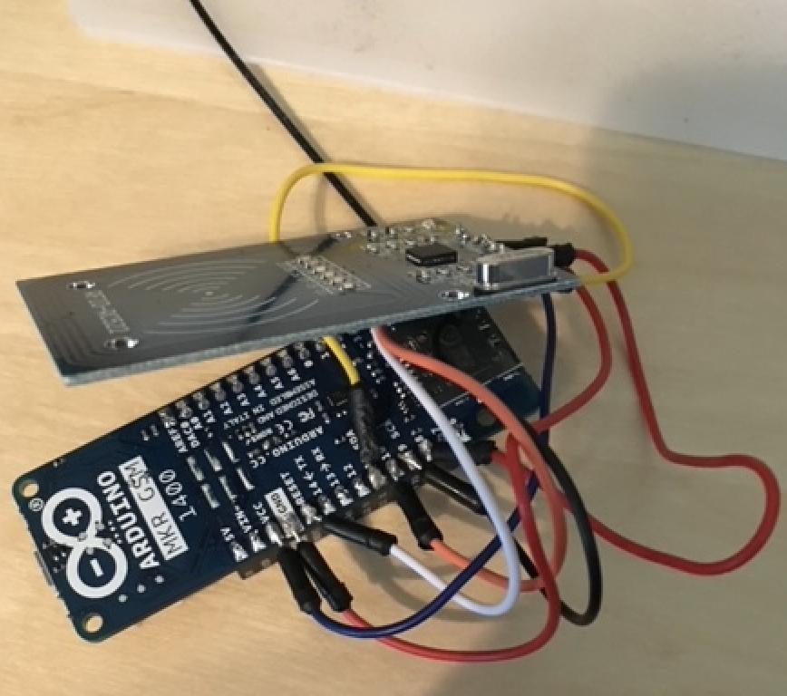

# rfidsnatcher
Arduino RFID Cloner and Texter.





Brought to you by rpigu-i.


## Project Description

This Arduino based RFID snatcher was built for an experiment/PoC for DefCon 26 (August 9 - 12 2018).

The project consists of several core components:

1. An Arduino microcontroller

2. Support for GSM (send SMS)

3. A battery 

4. Attenna 

5. An RFID shield.

6. A cheap SIM for sending SMS

The RFID shield allows you to scn passive devices such as key cards. It will then attempt to crack the card, and will text the cracked key to a cell phone.


## Source Code

The source code is relatively simple and uses some of the default code/concepts provided by many of the Arduino libraries and keys documentation that are available, including:

1. MFRC522 library example: https://github.com/miguelbalboa/rfid

2. Check default keys: https://code.google.com/p/mfcuk/wiki/MifareClassicDefaultKeys


Currently the phone number you wish to SMS to needs to be hard coded into the `rfid_gsm_default_keys.ino` file on line `157`

Example:

```
 char remoteNum[] = "0000000";  // telephone number to send sms
```


Line 203 contains the check for the MIFAR known keys. 

If you wish to just attempt to crack a single known key, this can be hard coced, or the array reduce to a single value:


```

  for (byte i = 0; i < MFRC522::MF_KEY_SIZE; i++) {
      key.keyByte[i] = knownKeys[k][i];
  }

```

or

```

 key.keyByte[i] = 0xFF;

```

This code can be uploaded to your microcontroller through the Arduino IDE.


## Hardware

The following example hardware was used to build the rfidsnatcher.





### Battery

A small PKCELL LP&785060 was used. THis is a 3.7v 2500 mAh battery.

It is smaller enough to easily clips onto the pins of an Arduino microcontroller and has a small form factor.

These can be picked up for around $15 on sites such as Adafruit:

https://www.adafruit.com/product/328


### Antenna 


Any small GSM/Celluar Quad-band antenna should work. The ones with adhesive backing will allow you to easy stick the antenna to the case for your device.

Adafruit carries a number of these, and they range from around $3 - $5 for basic models.

https://www.adafruit.com/?q=antenna+gsm&sort=BestMatch


### Microcontroller and GSM shield/module

This device was built using the Arduino MKR GSM 1400.


It has a very small form factor and combines the Arduino microcontroller and GSM functionality into a single device:

https://store-usa.arduino.cc/products/arduino-mkr-gsm-1400

These go for a little under $85 on the Arduino website.


### RFID Shield

Finally the device uses a RFID-RC522 shield.

These can be picked up on Amazon for around $8 and come with a spare keycard and door fob:

https://www.amazon.com/SunFounder-Mifare-Reader-Arduino-Raspberry/dp/B07KGBJ9VG


### Case

The original case for the PoC was printered on a Makerbot. Any custom 3d printed cases made to the approximate dimnensions of the finished device should be fine.


## Pin connections.

This device uses the following pins on the Arduino and shield. These will need to be soldered together using small patch cables.





### Arduino

1. vcc

2. grnd

3. RESET

4. 11 (SDA)

5. Pin 10

6. Pin 9

7. Pin 8 


### RFID-RC522 Shield


The following pins are used on the shield:


1. SDA

2. SCK

3. MOSI

4. MISO

5. GRND

6. RESET

7. 3.3v


### Wiring


Wire the Arduino pin on the left, to the shield pin on the right


| Arduino Pin | RFID Shield Pin |
|-------------|-----------------|
|   vcc       |   3.3.v         |
|   RESET     |   RESET         |
|   grnd      |   GRND          |
|   11 (SDA)  |   SDA           |
|   10        |   MISO          |
|   9         |   SCK           |
|   8         |   MOSI          |





Connect the antenna to the small little connector on the Arduino board. The battery connects to the small white battery connection point on the Arduino.


## SMS 

You can purchase a cheap SIM card from a local retailer for sending the SMS to your cell. This plugs right into the small socket on the back of the microcontroller.


## Usage

Scan a passive RFID device such as a room key with the rfidsnatcher. 

If the key card is successfully cracked, you will receive an SMS indicating this.

Remember this is for educational/demo purposes only. Use at your own risk. 

